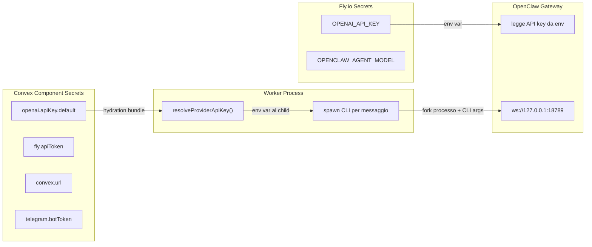
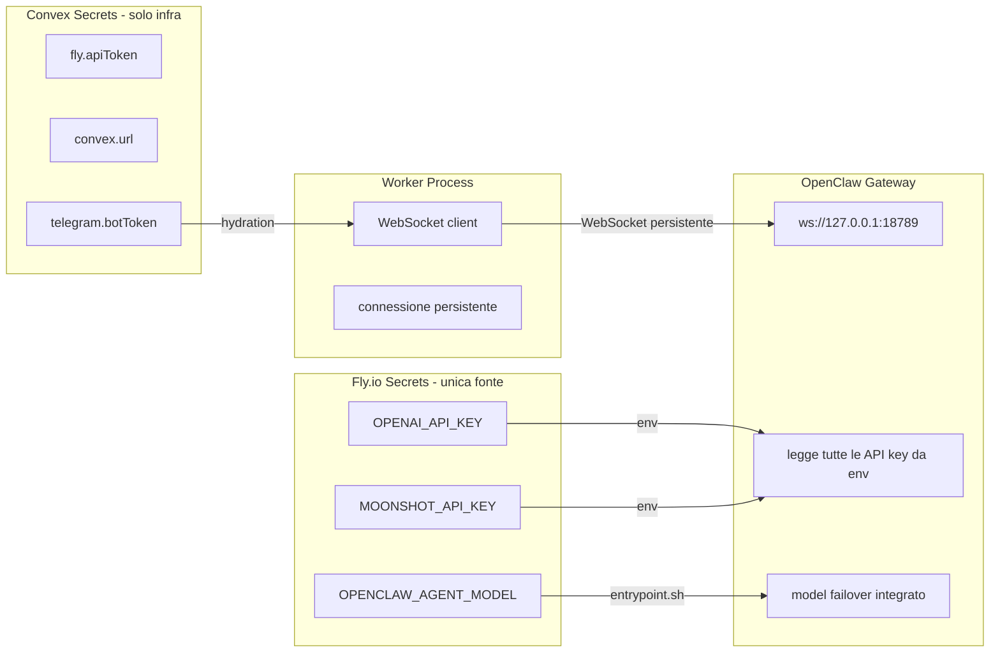

# Refactor Secrets, Multi-LLM e Performance

## Stato attuale e problemi




Problemi:

- **Secrets duplicati**: `OPENAI_API_KEY` esiste sia in Convex che in Fly.io
- **Overhead CLI**: ogni messaggio spawna `node /app/openclaw.mjs agent ...` (~5s overhead per fork + bootstrap V8)
- **Solo OpenAI**: nessun supporto multi-provider nel flusso attuale
- **Gateway cold start**: il worker parte prima del gateway e spreca tentativi

## Architettura target




---

## Fase 1: Semplificazione Secrets

Fly.io secrets diventa l'unica fonte per le API key LLM. Convex secrets resta solo per infra (`fly.apiToken`, `convex.url`, `telegram.botToken`).

### Modifiche

- **[worker.mjs](openclaw-okr-image/worker.mjs)**: Rimuovere `resolveProviderApiKey()`, `providerEnv()`, `parseLlmPolicy()`, `buildProviderAttempts()`. Il worker non gestisce piu provider/model/key — e il gateway a farlo via env vars.
- **[config.ts](agent-factory/src/component/config.ts)**: Rimuovere `openai.apiKey.*` dalla documentazione dei secretsRef. L'agentProfile non ha piu bisogno di referenziare le API key LLM.
- **Fly.io**: I secrets LLM sono impostati una volta con `fly secrets set` e ereditati da tutte le macchine automaticamente.

---

## Fase 2: Integrazione Moonshot Kimi K2.5

OpenClaw supporta nativamente Moonshot via OpenAI-compatible API. Serve configurare il provider nel `openclaw.json` e impostare la chiave.

### Configurazione Moonshot in openclaw.json

Il config reference di OpenClaw ([docs/providers/moonshot.md](https://github.com/openclaw/openclaw/blob/main/docs/providers/moonshot.md)) richiede:

```json5
{
  agents: { defaults: { model: { primary: "moonshot/kimi-k2.5" } } },
  models: {
    mode: "merge",
    providers: {
      moonshot: {
        baseUrl: "https://api.moonshot.ai/v1",
        apiKey: "${MOONSHOT_API_KEY}",
        api: "openai-completions",
        models: [{
          id: "kimi-k2.5",
          name: "Kimi K2.5",
          contextWindow: 256000,
          maxTokens: 8192,
        }],
      },
    },
  },
}
```

### Modifiche

- **[entrypoint.sh](openclaw-okr-image/entrypoint.sh)**: Estendere la sezione di seeding di `openclaw.json` per includere il blocco `models.providers.moonshot` quando `MOONSHOT_API_KEY` e presente nell'env. Usare `OPENCLAW_AGENT_MODEL` per il modello primario (es. `moonshot/kimi-k2.5`).
- **[worker.mjs](openclaw-okr-image/worker.mjs)**: Aggiornare `inferProviderFromModel()` per riconoscere `moonshot` e `kimi`. Aggiornare `providerEnv()` per mappare `moonshot` a `MOONSHOT_API_KEY` (serve solo fino a Fase 3 quando il CLI viene eliminato).
- **Fly.io secrets**:
  ```bash
  fly secrets set \
    MOONSHOT_API_KEY="sk-..." \
    OPENCLAW_AGENT_MODEL="moonshot/kimi-k2.5" \
    -a agent-factory-workers
  ```
- **Fallback OpenAI**: OpenClaw supporta il model failover nativo. Se Kimi fallisce, il gateway puo cadere su OpenAI se `OPENAI_API_KEY` e presente nell'env. Configurabile nel blocco `agents.defaults.model`:
  ```json5
  { model: { primary: "moonshot/kimi-k2.5", fallback: "openai/gpt-4o-mini" } }
  ```

---

## Fase 3: WebSocket diretto (Performance)

Il collo di bottiglia principale e lo spawn di un processo Node.js per ogni messaggio. I log mostrano che il gateway risponde in ~245ms, ma il round-trip CLI completo e ~5-13s. Connessione WebSocket persistente dal worker al gateway elimina questo overhead.

### Analisi overhead attuale

Per ogni messaggio il worker:

1. Verifica readiness TCP del gateway (~100ms)
2. `spawn("./openclaw.mjs", ["agent", "--agent", "main", "--message", prompt])` - fork + V8 bootstrap (~3-5s)
3. Il CLI stabilisce una nuova connessione WebSocket al gateway
4. Il gateway processa (~245ms)
5. Il CLI restituisce stdout e chiude

### Soluzione: client WebSocket nel worker

Sostituire `runOpenClawAttempt()` (linee 304-368 di [worker.mjs](openclaw-okr-image/worker.mjs)) con una connessione WebSocket persistente al gateway.

Il protocollo gateway di OpenClaw usa WebSocket JSON-RPC. Il worker:

1. All'avvio, stabilisce una singola connessione WS al gateway (dopo readiness)
2. Per ogni messaggio, invia una richiesta `agent` via WS
3. Riceve la risposta via WS
4. La connessione resta aperta per tutta la vita del worker

### Modifiche

- **[worker.mjs](openclaw-okr-image/worker.mjs)**:
  - Aggiungere classe `GatewayClient` che gestisce la connessione WS persistente
  - `waitForGateway()`: loop di connessione con backoff fino a gateway ready
  - `sendAgentMessage(prompt)`: invia richiesta agent via WS, ritorna risposta
  - Rimuovere `spawn()`, `ensureGatewayReady()`, tutto il codice CLI
  - Rimuovere le funzioni di risoluzione provider/key (il gateway gestisce tutto)
  - Riduzione stimata: ~150 righe rimosse, ~60 righe aggiunte
- **[entrypoint.sh](openclaw-okr-image/entrypoint.sh)**:
  - Rendere il readiness timeout bloccante (`OPENCLAW_GATEWAY_READY_REQUIRED=true`)
  - Aumentare il timeout a 60s (il gateway ha bisogno di ~50s per partire)
  - Il worker non parte finche il gateway non e pronto, eliminando i retry inutili
- **Performance attesa**:
  - Tempo risposta: da ~5-13s a ~300-500ms per messaggio
  - Memoria: nessun processo extra, il worker usa la connessione WS esistente
  - Nessun bisogno di aumentare la RAM

### Nota sul protocollo WS

Prima dell'implementazione serve verificare il formato esatto dei messaggi WS del gateway OpenClaw. Dalla source code ([src/gateway/](https://github.com/openclaw/openclaw/tree/main/src)) si puo ricavare il protocollo JSON-RPC. Il log `[ws] res agent 245ms runId=...` conferma che il gateway accetta richieste `agent` via WS.

---

## Riepilogo file modificati

- `openclaw-okr-image/entrypoint.sh` — config Moonshot + readiness bloccante
- `openclaw-okr-image/worker.mjs` — WebSocket client, rimozione CLI/secrets
- `agent-factory/src/component/config.ts` — pulizia DEFAULT_WORKER_RUNTIME_ENV
- `agent-factory/src/component/queue.ts` — rimozione secretsRef per LLM keys dall'hydration (opzionale, backward-compatible)

