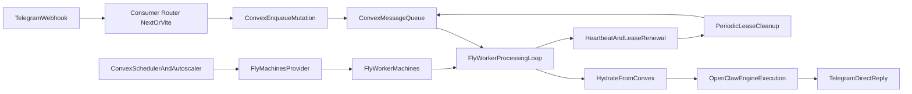

# Convex Agent Factory

[](https://badge.fury.io/js/@example%2Fagent-factory)

A Convex component for hydration-based orchestration of OpenClaw agents on a generic worker pool (Fly Machines first, provider abstraction built-in).

## Installation

Create a `convex.config.ts` file in your app's `convex/` folder and install the
component by calling `use`:

```ts
// convex/convex.config.ts
import { defineApp } from "convex/server";
import agentFactory from "@okrlinkhub/agent-factory/convex.config.js";

const app = defineApp();
app.use(agentFactory);

export default app;
```

## Usage

```ts
import { components } from "./_generated/api";
import { mutation } from "./_generated/server";
import { v } from "convex/values";

export const enqueueTelegramMessage = mutation({
  args: { text: v.string(), chatId: v.string() },
  handler: async (ctx, args) => {
    return await ctx.runMutation(components.agentFactory.lib.enqueue, {
      conversationId: `telegram:${args.chatId}`,
      agentKey: "default",
      payload: {
        provider: "telegram",
        providerUserId: args.chatId,
        messageText: args.text,
      },
    });
  },
});
```

After enqueue, a **queue processor runtime** must process the queue by calling:
- `components.agentFactory.lib.claim`
- `components.agentFactory.lib.getHydrationBundle`
- `components.agentFactory.lib.heartbeat`
- `components.agentFactory.lib.complete` or `components.agentFactory.lib.fail`

In this project setup, the queue processor runtime is **Fly worker-only** (not the consumer webhook app).
The consumer app receives ingress and enqueues, while Fly workers dequeue and execute jobs.
The worker should consume tenant-specific tokens from the hydration payload (resolved by the component), not from global Fly env vars.

If you use `exposeApi(...)`, the worker contract is available directly on the consumer API surface:
- `workerClaim`
- `workerHydrationBundle`
- `workerHeartbeat`
- `workerComplete`
- `workerFail`

### HTTP Routes

You can mount an ingress webhook route in your app:

```ts
import { httpRouter } from "convex/server";
import { registerRoutes } from "@okrlinkhub/agent-factory";
import { components } from "./_generated/api";

const http = httpRouter();

registerRoutes(http, components.agentFactory, {
  pathPrefix: "/agent-factory",
});

export default http;
```

This exposes:
- `POST /agent-factory/telegram/webhook` -> enqueue-only (no business processing)

Important: the webhook/router only receives ingress and enqueues.
Do not point Telegram directly to Fly worker machines.
Use webhook -> consumer app (Next.js/Vercel) -> Convex queue -> Fly workers (pull-based processing).

### One-time Telegram pairing and internal user mapping

The component can keep the user-to-agent mapping internally through `identityBindings`.
You can bind your consumer user id directly to an `agentKey` without managing a custom
table in the consumer app.

Typical one-time pairing flow:

1. Your app authenticates the user and creates a one-time pairing code via
   `createPairingCode`.
2. User opens Telegram deep-link (`/start <pairingCode>`).
3. `registerRoutes(...)` webhook consumes the pairing code and performs
   `bindUserAgent` automatically with `source: "telegram_pairing"` and
   Telegram ids from the update.
4. Webhook ingress then resolves the binding internally and enqueues with the mapped
   `agentKey`.

Available pairing APIs (via `exposeApi(...)`):
- `createPairingCode`
- `getPairingCodeStatus`

Telegram token storage (multi-tenant):
- store tenant token in component secrets with an agent-scoped ref (for example `telegram.botToken.<agentKey>`)
- include that ref in `agentProfiles.secretsRef`
- worker gets resolved plaintext from hydration bundle (`telegramBotToken`) at runtime
- do not use a single global `TELEGRAM_BOT_TOKEN` on Fly app

`registerRoutes(...)` supports this behavior with:
- `resolveAgentKeyFromBinding` (default `true`)
- `fallbackAgentKey` (default `"default"`)
- `requireBindingForTelegram` (default `false`, when `true` rejects unbound users)

Special handling for `/start`:
- `/start <pairingCode>` attempts pairing consumption and does not enqueue the command.
- invalid `/start` payload returns `200` with pairing error details to avoid Telegram retries.

## Architecture



## Data model

Core tables:
- `agentProfiles`
- `conversations`
- `messageQueue`
- `workers`
- `secrets`

Hydration-optimized tables:
- `workspaceDocuments`
- `agentSkills`
- `skillAssets`
- `hydrationSnapshots`
- `conversationHydrationCache`

## OpenClaw workspace mapping

| OpenClaw source | Convex table |
|---|---|
| `AGENTS.md`, `SOUL.md`, `USER.md`, `IDENTITY.md`, `HEARTBEAT.md`, `TOOLS.md` | `workspaceDocuments` |
| `memory/YYYY-MM-DD.md`, `MEMORY.md` | `workspaceDocuments` + `hydrationSnapshots.memoryWindow` |
| `skills/*/SKILL.md` | `agentSkills` |
| `skills/*/scripts/*`, `skills/*/config/*` metadata | `skillAssets` |
| Compiled hydration payload | `hydrationSnapshots` |
| Conversation-specific deltas | `conversationHydrationCache` |

## Failure model

- Worker crash during processing does not lose data.
- Each claimed job has a lease (`leaseId`, `leaseExpiresAt`) and heartbeat.
- Cleanup job requeues expired `processing` jobs and unlocks conversations.
- Retry uses exponential backoff with dead-letter fallback.

## Config-first

`src/component/config.ts` defines type-safe policies:
- queue policy
- retry policy
- lease policy
- scaling policy
- hydration policy
- provider config

## Fly.io provider notes

The current provider implementation uses Fly Machines API endpoints for:
- create machine
- list machines
- cordon machine
- terminate machine

Recommended runtime split:
- Consumer app (Next.js/Vercel): webhook ingress + enqueue only
- Fly worker app: claim/heartbeat/complete/fail loop

Anti-pattern to avoid:
- Telegram webhook -> Fly worker HTTP endpoint
- Reason: workers are batch processors, may be scaled to zero, and should not be used as public ingress.
- Global Fly env `TELEGRAM_BOT_TOKEN` for all tenants
- Reason: breaks multi-tenant isolation and forces shared bot credentials.

References:
- https://docs.machines.dev/
- https://fly.io/docs/machines/api/machines-resource/
- https://docs.convex.dev/components/authoring

## Development

```sh
npm i
npm run dev
```
