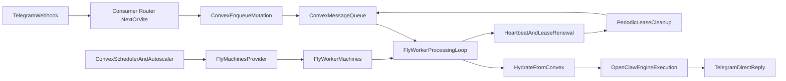

# Convex Agent Factory

[](https://badge.fury.io/js/@example%2Fagent-factory)

A Convex component for hydration-based orchestration of OpenClaw agents on a generic worker pool (Fly Machines first, provider abstraction built-in).

## Installation

Create a `convex.config.ts` file in your app's `convex/` folder and install the
component by calling `use`:

```ts
// convex/convex.config.ts
import { defineApp } from "convex/server";
import agentFactory from "@okrlinkhub/agent-factory/convex.config.js";

const app = defineApp();
app.use(agentFactory);

export default app;
```

## Usage

### First required setup: mandatory secrets for every worker/agent

Before running worker autoscaling (enqueue trigger, cron, or manual reconcile), you must
store **both** secrets in the component secret store:

- `convex.url`
- `fly.apiToken`

Every spawned worker/agent needs these values at runtime. Manual "Start Workers" can work
when you pass values inline from the UI, but automatic paths (enqueue + cron) rely on
these stored secrets.

If one is missing, reconcile fails with errors like:
- `Missing Convex URL. Import an active 'convex.url' secret or pass convexUrl explicitly.`
- `Missing Fly API token. Import an active 'fly.apiToken' secret or pass flyApiToken explicitly.`

Set them once:

```sh
npx convex run example:importSecret '{
  "secretRef": "convex.url",
  "plaintextValue": "https://<your-convex-deployment>.convex.site"
}'

npx convex run example:importSecret '{
  "secretRef": "fly.apiToken",
  "plaintextValue": "fly_XXXXXXXXXXXXXXXX"
}'
```

Important URL mapping:
- Fly worker environment variable `CONVEX_URL` must use the `.convex.cloud` URL.
- Component secret `convex.url` must use the `.convex.site` URL (used by component workflows and webhook-facing integration paths).

Verify status:

```sh
npx convex run example:secretStatus '{
  "secretRefs": [
    "convex.url",
    "fly.apiToken",
    "telegram.botToken",
    "agent-bridge.serviceKey.default"
  ]
}'
```

In the example UI (`example/src/App.tsx`), this is shown as step
`0) Mandatory: configure convex.url secret`; make sure `fly.apiToken` is also imported
as an active component secret.

```ts
import { components } from "./_generated/api";
import { mutation } from "./_generated/server";
import { v } from "convex/values";

export const enqueueTelegramMessage = mutation({
  args: { text: v.string(), chatId: v.string() },
  handler: async (ctx, args) => {
    return await ctx.runMutation(components.agentFactory.lib.enqueue, {
      conversationId: `telegram:${args.chatId}`,
      agentKey: "default",
      payload: {
        provider: "telegram",
        providerUserId: args.chatId,
        messageText: args.text,
      },
    });
  },
});
```

After enqueue, a **queue processor runtime** must process the queue by calling:
- `components.agentFactory.lib.claim`
- `components.agentFactory.lib.getHydrationBundle`
- `components.agentFactory.lib.heartbeat`
- `components.agentFactory.lib.complete` or `components.agentFactory.lib.fail`

Worker autoscaling reconcile now follows a hybrid model:
- `enqueue` schedules an immediate async reconcile trigger (`runAfter(0, ...)`)
- a periodic cron fallback is still recommended to recover from missed triggers
- desired worker count is conversation-aware, so multiple queued messages on the same `conversationId` do not over-scale worker spawn

In this project setup, the queue processor runtime is **Fly worker-only** (not the consumer webhook app).
The consumer app receives ingress and enqueues, while Fly workers dequeue and execute jobs.
The worker should consume tenant-specific tokens from the hydration payload (resolved by the component), not from global Fly env vars.

### Cron fallback every 5 minutes

In your Convex app, add a cron fallback for reconcile:

```ts
import { cronJobs } from "convex/server";
import { api } from "./_generated/api";

const crons = cronJobs();

crons.interval(
  "agent-factory reconcile workers fallback",
  { minutes: 5 },
  api.example.startWorkers,
  {},
);

export default crons;
```

This cron is a safety net. The primary path remains enqueue-triggered reconcile.

### Agent pushing schedule (hourly dispatcher)

For agent pushing, the recommended scheduler is an hourly cron that dispatches due jobs:

```ts
import { cronJobs } from "convex/server";
import { api } from "./_generated/api";

const crons = cronJobs();

crons.cron(
  "agent-factory push dispatch hourly",
  "0 * * * *",
  api.example.dispatchDuePushJobs,
  {},
);

export default crons;
```

Important product constraint:
- job configuration supports only fixed schedule slots (`HH:mm`, plus weekday/day-of-month)
- minute-based recurrence ("every N minutes") is intentionally not supported

Admin broadcast is also supported through `sendBroadcastToAllActiveAgents`, which enqueues one message per active target and records a dispatch audit.

### LLM configuration (Fly env)

The model/provider is controlled by Fly worker environment variables (for example `OPENCLAW_AGENT_MODEL`, `MOONSHOT_API_KEY`, `OPENAI_API_KEY`) and applied at runtime by the worker image bootstrap.

Why:
- keeps model routing as infrastructure/runtime concern
- avoids per-agent schema coupling to a specific LLM field
- lets you switch model/provider with a Fly deploy or env change only

Practical notes:
- set model/provider env on the Fly app (`fly secrets set` / `[env]` in `fly.toml`)
- keep `agentProfiles` focused on identity, skills, docs, and secrets references
- worker image tag stays centralized in `src/component/config.ts` (`DEFAULT_WORKER_IMAGE`)

If you use `exposeApi(...)`, the worker contract is available directly on the consumer API surface:
- `workerClaim`
- `workerHydrationBundle`
- `workerHeartbeat`
- `workerComplete`
- `workerFail`

### Native integration with `agent-bridge` (no consumer glue code)

`agent-factory` now exposes a native contract for bridge execution. You only configure profile + secrets in the component.

1) Configure an agent profile with bridge settings:

```ts
await ctx.runMutation(components.agentFactory.lib.configureAgent, {
  agentKey: "default",
  version: "1.0.0",
  soulMd: "# Soul",
  clientMd: "# Client",
  skills: ["agent-bridge"],
  secretsRef: [],
  bridgeConfig: {
    enabled: true,
    baseUrl: "https://<your-consumer>.convex.site",
    serviceId: "openclaw-prod",
    appKey: "crm",
  },
  enabled: true,
});
```

2) Import bridge service key in component secrets:

```sh
npx convex run example:importSecret '{
  "secretRef": "agent-bridge.serviceKey.default",
  "plaintextValue": "abs_live_XXXXXXXXXXXXXXXX"
}'
```

Naming convention supported by hydration resolver:
- per-agent service key: `agent-bridge.serviceKey.<agentKey>` (recommended)
- global service key fallback: `agent-bridge.serviceKey`
- optional profile override: `bridgeConfig.serviceKeySecretRef`
- per-agent base URL map JSON (for strict `execute-on-behalf` skills): `agent-bridge.baseUrlMapJson.<agentKey>`
- global base URL map JSON fallback: `agent-bridge.baseUrlMapJson`
- optional per-agent/global overrides for `baseUrl`, `serviceId`, `appKey` via:
  - `agent-bridge.baseUrl.<agentKey>` / `agent-bridge.baseUrl`
  - `agent-bridge.serviceId.<agentKey>` / `agent-bridge.serviceId`
  - `agent-bridge.appKey.<agentKey>` / `agent-bridge.appKey`

Example value for `agent-bridge.baseUrlMapJson.<agentKey>`:

```json
{"linkhub-w4":"https://www.okrlink.app","amc":"https://amc-primogroup.convex.site"}
```

This is still stored as a normal component secret ref (same naming convention as other
bridge secrets). The secret **value** is the JSON map expected by strict agent-bridge
skills (`APP_BASE_URL_MAP_JSON`).

Hydration includes `bridgeRuntimeConfig` for the worker loop.

3) In worker runtime use built-in helpers from this package:

```ts
import {
  maybeExecuteBridgeToolCall,
  resolveBridgeRuntimeConfig,
} from "@okrlinkhub/agent-factory";

const resolved = resolveBridgeRuntimeConfig(hydration.bridgeRuntimeConfig);
if (resolved.ok) {
  // Optional proactive resolution check
}

const toolResult = await maybeExecuteBridgeToolCall({
  toolName: pendingToolCall.toolName,
  toolArgs,
  hydratedConfig: hydration.bridgeRuntimeConfig,
  userToken: maybeUserJwtOrNull,
});
```

`maybeExecuteBridgeToolCall` handles:
- `bridge.<functionKey>` mapping to `POST /agent/execute`
- strict headers (`X-Agent-Service-Id`, `X-Agent-Service-Key`, `X-Agent-App`)
- retry for `429` and `5xx`
- deterministic response object to map back into conversation/tool messages

Fallback env (worker-side only, used when hydration misses values):
- `OPENCLAW_AGENT_BRIDGE_BASE_URL` or `AGENT_BRIDGE_BASE_URL`
- `OPENCLAW_SERVICE_ID` or `AGENT_BRIDGE_SERVICE_ID`
- `OPENCLAW_SERVICE_KEY` or `AGENT_BRIDGE_SERVICE_KEY`
- `OPENCLAW_AGENT_APP` / `OPENCLAW_APP_KEY` / `AGENT_BRIDGE_APP_KEY`

Fly.io practical note (recommended for strict bridge flow):
- set `AGENT_BRIDGE_DEFAULT_APP_KEY`, `APP_BASE_URL_MAP_JSON`, `OPENCLAW_SERVICE_ID`,
  and `OPENCLAW_SERVICE_KEY` directly in Fly app env/secrets (`fly secrets set` or `fly.toml [env]`).
- keep these runtime values in Fly even when component secrets are configured, so workers
  can always resolve strict `execute-on-behalf` calls without depending on secret hydration timing.

### HTTP Routes

You can mount an ingress webhook route in your app:

```ts
import { httpRouter } from "convex/server";
import { registerRoutes } from "@okrlinkhub/agent-factory";
import { components } from "./_generated/api";

const http = httpRouter();

registerRoutes(http, components.agentFactory, {
  pathPrefix: "/agent-factory",
});

export default http;
```

This exposes:
- `POST /agent-factory/telegram/webhook` -> enqueue-only (no business processing)

Important: the webhook/router only receives ingress and enqueues.
Do not point Telegram directly to Fly worker machines.
Use webhook -> consumer app (Next.js/Vercel) -> Convex queue -> Fly workers (pull-based processing).

### One-time Telegram pairing and internal user mapping

The component can keep the user-to-agent mapping internally through `identityBindings`.
You can bind your consumer user id directly to an `agentKey` without managing a custom
table in the consumer app.

#### Mandatory prerequisite: configure Telegram webhook first

Before creating pairing codes, configure and verify Telegram webhook against your
consumer ingress route.

Use the exposed API:

```ts
await configureTelegramWebhook({
  convexSiteUrl: "https://<your-deployment>.convex.site",
  secretRef: "telegram.botToken.default", // optional, default shown
});
```

This API:
- loads bot token from component secrets (active secret for `secretRef`)
- calls Telegram `setWebhook`
- verifies status with `getWebhookInfo`
- returns `isReady` so your UI can gate the pairing flow

If `isReady` is false, do not proceed with pairing.

Typical one-time pairing flow:

1. Configure webhook and verify `isReady === true` via `configureTelegramWebhook`.
2. Your app authenticates the user and creates a one-time pairing code via
   `createPairingCode`.
3. User opens Telegram deep-link (`/start <pairingCode>`).
4. `registerRoutes(...)` webhook consumes the pairing code and performs
   `bindUserAgent` automatically with `source: "telegram_pairing"` and
   Telegram ids from the update.
5. Webhook ingress then resolves the binding internally and enqueues with the mapped
   `agentKey`.

Available pairing APIs (via `exposeApi(...)`):
- `createPairingCode`
- `getPairingCodeStatus`
- `configureTelegramWebhook`

Telegram token storage (multi-tenant):
- store tenant token in component secrets with an agent-scoped ref (for example `telegram.botToken.<agentKey>`)
- include that ref in `agentProfiles.secretsRef`
- worker gets resolved plaintext from hydration bundle (`telegramBotToken`) at runtime
- do not use a single global `TELEGRAM_BOT_TOKEN` on Fly app

`registerRoutes(...)` supports this behavior with:
- `resolveAgentKeyFromBinding` (default `true`)
- `fallbackAgentKey` (default `"default"`)
- `requireBindingForTelegram` (default `false`, when `true` rejects unbound users)

Special handling for `/start`:
- `/start <pairingCode>` attempts pairing consumption and does not enqueue the command.
- invalid `/start` payload returns `200` with pairing error details to avoid Telegram retries.

## Architecture



## Data model

Core tables:
- `agentProfiles`
- `conversations`
- `messageQueue`
- `workers`
- `secrets`

Hydration/runtime tables:
- `conversationHydrationCache`
- `dataSnapshots`

## Recent updates

- `idleTimeoutMs` aligned to 5 minutes and `workers.scheduledShutdownAt` now tracks idle lifecycle from `lastClaimAt`.
- Pre-stop drain protocol added: worker snapshots `/data` before termination and uploads archive metadata into `dataSnapshots`.
- Restore on boot added: new workers can rehydrate from latest snapshot archive.
- Hydration improved with `conversationHydrationCache` delta usage.
- `agentSkills` and `skillAssets` removed from schema: skills must be baked into the OpenClaw worker image.
- Worker control/snapshot APIs exposed for runtime loop (`workerControlState`, snapshot upload/finalize/fail, restore lookup).

## OpenClaw workspace persistence

| OpenClaw source | Persistence layer |
|---|---|
| `AGENTS.md`, `SOUL.md`, `USER.md`, `IDENTITY.md`, `HEARTBEAT.md`, `TOOLS.md` | worker filesystem backup (`/data/workspace`) |
| `memory/YYYY-MM-DD.md`, `MEMORY.md` | worker filesystem backup (`/data/workspace`) |
| Skills and related assets | bundled directly in worker image (`openclaw-okr-image`) |
| Conversation-specific deltas | `conversationHydrationCache` |

## Failure model

- Worker crash during processing does not lose data.
- Each claimed job has a lease (`leaseId`, `leaseExpiresAt`) and heartbeat.
- Cleanup job requeues expired `processing` jobs and unlocks conversations.
- Retry uses exponential backoff with dead-letter fallback.

## Config-first

`src/component/config.ts` defines type-safe policies:
- queue policy
- retry policy
- lease policy
- scaling policy
- provider config

## Fly.io provider notes

The current provider implementation uses Fly Machines API endpoints for:
- create machine
- list machines
- cordon machine
- terminate machine

### Isolation rule: one Fly app per Convex deployment

Do **not** share the same Fly app across multiple Convex backends/components that run
their own queue polling/reconcile loop.

Why this is required:
- workers in a Fly app share the same control plane (create/list/stop),
- each backend computes desired capacity from its own queue state only,
- mixed backends in one app can stop each other's machines or produce unpredictable polling behavior.

Recommended pattern:
- one Convex backend -> one dedicated Fly app (for example `agent-factory-workers-prod`)
- another Convex backend -> another dedicated Fly app (for example `agent-factory-workers-staging`)
- keep `providerConfig.appName` and worker image registry aligned per backend/environment.

### Worker image setup (required first step for custom skills)

Any new skill you want inside OpenClaw agents must be added to the worker image source repo:
- https://github.com/okrlinkhub/openclaw-okr-image

Fork this repository to maintain your own image with your custom skills/assets.

First required flow:
1) Take the image repo (fork/clone your own `openclaw-okr-image`).
2) Build and deploy it on your own Fly app.
   - Recommended build mode: remote Fly builder, `depot` disabled, `--remote-only`.
3) Use the published image as reference in `src/component/config.ts` (`DEFAULT_WORKER_IMAGE` is the source of truth).
4) Repeat the same process for every runtime/skills update.

**Enterprise security model**: The worker image enforces a security policy where only skills explicitly included by the image maintainer are installed by default. Any other skills that may be present in the workspace are automatically removed on each worker startup. This ensures that only approved, vetted skills from the image source can execute within your OpenClaw agents.

### Worker image update procedure

When you update the worker runtime (for example in `openclaw-okr-image/worker.mjs`), use this flow to publish and roll out safely.

1) Deploy with remote Fly builder (explicitly disabling Depot):

```sh
cd /path/to/openclaw-okr-image
fly deploy --remote-only --depot=false --yes
```

2) If deployment fails with `CONVEX_URL not set`, set the secret and retry:

```sh
fly secrets set CONVEX_URL="https://<your-convex-deployment>.convex.cloud" -a <your-fly-worker-app>
```

3) Capture the new image tag from deploy output (for example
`registry.fly.io/<your-fly-worker-app>:deployment-XXXXXXXXXXXX`), then update
`src/component/config.ts` in this repo:

```ts
export const DEFAULT_WORKER_IMAGE =
  "registry.fly.io/<your-fly-worker-app>:deployment-XXXXXXXXXXXX";
```

4) Verify rollout:

```sh
fly status -a <your-fly-worker-app>
fly logs -a <your-fly-worker-app> --no-tail
```

5) (Recommended) Commit the `DEFAULT_WORKER_IMAGE` update so scheduler-driven
spawns use the exact image that was just deployed.

Recommended runtime split:
- Consumer app (Next.js/Vercel): webhook ingress + enqueue only
- Fly worker app: claim/heartbeat/complete/fail loop

Anti-pattern to avoid:
- Telegram webhook -> Fly worker HTTP endpoint
- Reason: workers are batch processors, may be scaled to zero, and should not be used as public ingress.
- Global Fly env `TELEGRAM_BOT_TOKEN` for all tenants
- Reason: breaks multi-tenant isolation and forces shared bot credentials.

References:
- https://docs.machines.dev/
- https://fly.io/docs/machines/api/machines-resource/
- https://docs.convex.dev/components/authoring

## Development

```sh
npm i
npm run dev
```
