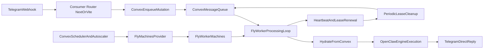

# Convex Agent Factory

[npm version](https://badge.fury.io/js/@example%2Fagent-factory)

A Convex component for hydration-based orchestration of OpenClaw agents on a generic worker pool (Fly Machines first, provider abstraction built-in).

## Installation

Create a `convex.config.ts` file in your app's `convex/` folder and install the
component by calling `use`:

```ts
// convex/convex.config.ts
import { defineApp } from "convex/server";
import agentFactory from "@okrlinkhub/agent-factory/convex.config.js";

const app = defineApp();
app.use(agentFactory);

export default app;
```

## Upgrade to 1.0.0

Version `1.0.0` introduces a **worker lifecycle breaking change**.

What changed:

- `workers.status` is no longer binary.
- New persisted statuses are now possible: `draining` and `stopping`.
- The lifecycle is now `active -> draining -> stopping -> stopped`.
- `active` now means **claimable**, not just "row exists and machine once existed".

Current status values:

- `active`: worker is healthy and can claim new jobs.
- `draining`: worker must stop claiming and is waiting for final snapshot / shutdown progression.
- `stopping`: final snapshot is ready or provider teardown is in progress / pending retry.
- `stopped`: terminal state for that worker instance. Stopped workers are never reactivated.

Important compatibility notes:

- **No manual data migration is required** if your existing rows only contain `active` or `stopped`.
- **Consumer code may require updates** if it assumes `worker.status` can only be `active` or `stopped`.
- Any exhaustive `switch` / `if` logic, dashboards, alerts, or admin tools that parse worker status must handle `draining` and `stopping`.
- `workerControlState` is stricter now: workers in non-claimable states, stale-heartbeat workers, and overdue workers return `shouldStop = true`.

Recommended upgrade checklist:

1. Upgrade the package to `1.0.0`.
2. Regenerate Convex bindings in the consumer app.
3. Update any consumer-side status handling for `workers.status`.
4. Ensure a periodic reconcile fallback cron exists in your Convex app.
5. Redeploy the worker runtime so it can react correctly to the stricter control-state semantics.

Reference example for the recommended reconcile fallback:

```ts
import { cronJobs } from "convex/server";
import { api } from "./_generated/api";

const crons = cronJobs();

crons.interval(
  "agent-factory reconcile workers fallback",
  { minutes: 5 },
  api.example.startWorkers,
  {},
);

export default crons;
```

## Upgrade to 2.0.0

Version `2.0.0` introduces a **conversation identity breaking change**.

What changed:

- `conversationId` is now required for worker snapshot upload and restore APIs.
- `dataSnapshots.conversationId` is now mandatory in persisted storage.
- Snapshot restore no longer falls back to the latest archive for `workspaceId + agentKey`.
- User-agent flows now use a stable conversation identity scoped to `consumerUserId + agentKey`.
- Telegram pairing no longer changes the conversation lineage used for chat history and snapshots.

Important warnings:

- This release is intentionally **not backward compatible** with legacy snapshots created without `conversationId`.
- Existing non-prod agents, snapshots, bindings, and conversations created with the old model should be deleted before rollout.
- If a worker runtime or consumer app still calls snapshot APIs without `conversationId`, the call will now fail at validation time.
- If your integration assumed conversation IDs like `telegram:<chatId>` or `user:<consumerUserId>` for user-agent flows, you must update it to treat `conversationId` as an opaque stable identifier.
- If you have custom dashboards, scripts, or admin tools that query snapshots only by `agentKey`, they must be updated to scope by `workspaceId + agentKey + conversationId`.

Quick upgrade checklist:

1. Delete legacy non-production agents, snapshots, conversations, and identity bindings created before this release.
2. Upgrade the package to `2.0.0`.
3. Regenerate Convex bindings in the consumer app.
4. Redeploy all worker runtimes and make sure they always pass `conversationId` to snapshot upload/restore APIs.
5. Update any custom integrations that assumed user-agent conversation IDs were derived from Telegram chat IDs.
6. Verify that snapshot restore returns data only for the exact `workspaceId + agentKey + conversationId` tuple.
7. Smoke-test one manual user-agent flow, one Telegram-paired flow, and one worker snapshot restore flow before wider rollout.

Recommended release notes to communicate to consumers:

- treat this as a major upgrade, not a safe drop-in patch;
- start from a clean non-prod environment;
- roll out workers and consumer app together;
- do not reuse legacy archives generated before `conversationId` became mandatory.

## Usage

### User-facing agent APIs

Starting with this release, the component also exposes an additive set of **user-facing aggregate APIs** for building pages like `MyAgent` and `MyAgentNew` without reconstructing state in the consumer app.

What stays in the consumer app:

- naming policy for agents and Telegram usernames
- product-specific onboarding copy
- cron presets or local `agentSettings`

What is now exposed directly by the component:

- user agent overview and active/history lookup
- onboarding and pairing state
- conversation view and queue items for a user agent
- agent-scoped push jobs and aggregate usage stats
- user-centric snapshot listing and latest snapshot lookup

Core APIs added for this pattern:

- `listUserAgents`
- `getUserAgent`
- `getActiveUserAgent`
- `getUserAgentsOverview`
- `createUserAgentPairing`
- `getUserAgentPairingStatus`
- `importTelegramTokenForAgent`
- `getUserAgentOnboardingState`
- `getConversationViewForUserAgent`
- `listQueueItemsForUserAgent`
- `sendMessageToUserAgent`
- `listPushJobsForAgent`
- `listPushDispatchesForAgent`
- `getUserAgentUsageStats`
- `listSnapshotsForUserAgent`
- `getLatestSnapshotForUserAgent`

For user-agent flows, the component now treats `conversationId` as a stable identity scoped to
`consumerUserId + agentKey`, so Telegram pairing changes do not move the chat to a different
conversation history or snapshot lineage.

Minimal consumer example:

```ts
import { query, mutation } from "./_generated/server";
import { components } from "./_generated/api";
import { v } from "convex/values";

export const getMyAgentOverview = query({
  args: { consumerUserId: v.string() },
  handler: async (ctx, args) => {
    return await ctx.runQuery(components.agentFactory.lib.getUserAgentsOverview, {
      consumerUserId: args.consumerUserId,
    });
  },
});

export const sendMessageToMyAgent = mutation({
  args: {
    consumerUserId: v.string(),
    agentKey: v.string(),
    content: v.string(),
  },
  handler: async (ctx, args) => {
    return await ctx.runMutation(components.agentFactory.lib.sendMessageToUserAgent, {
      consumerUserId: args.consumerUserId,
      agentKey: args.agentKey,
      content: args.content,
    });
  },
});
```

The example consumer in [example/convex/example.ts](example/convex/example.ts) re-exports these APIs through `exposeApi(...)` and includes lightweight wrappers you can adapt.

### First required setup: mandatory secrets for every worker/agent

Before running worker autoscaling (enqueue trigger, cron, or manual reconcile), you must
store **both** secrets in the component secret store:

- `convex.url`
- `fly.apiToken`

Every spawned worker/agent needs these values at runtime. Manual "Start Workers" can work
when you pass values inline from the UI, but automatic paths (enqueue + cron) rely on
these stored secrets.

If one is missing, reconcile fails with errors like:

- `Missing Convex URL. Import an active 'convex.url' secret or pass convexUrl explicitly.`
- `Missing Fly API token. Import an active 'fly.apiToken' secret or pass flyApiToken explicitly.`

Set them once:

```sh
npx convex run example:importSecret '{
  "secretRef": "convex.url",
  "plaintextValue": "https://<your-convex-deployment>.convex.site"
}'

npx convex run example:importSecret '{
  "secretRef": "fly.apiToken",
  "plaintextValue": "fly_XXXXXXXXXXXXXXXX"
}'
```

Important URL mapping:

- Fly worker environment variable `CONVEX_URL` must use the `.convex.cloud` URL.
- Component secret `convex.url` must use the `.convex.site` URL (used by component workflows and webhook-facing integration paths).

Verify status:

```sh
npx convex run example:secretStatus '{
  "secretRefs": [
    "convex.url",
    "fly.apiToken",
    "telegram.botToken",
    "agent-bridge.serviceKey.default"
  ]
}'
```

In the example UI (`example/src/App.tsx`), this is shown as step
`0) Mandatory: configure convex.url secret`; make sure `fly.apiToken` is also imported
as an active component secret.

```ts
import { components } from "./_generated/api";
import { mutation } from "./_generated/server";
import { v } from "convex/values";

export const enqueueTelegramMessage = mutation({
  args: { text: v.string(), chatId: v.string() },
  handler: async (ctx, args) => {
    return await ctx.runMutation(components.agentFactory.lib.enqueue, {
      conversationId: `telegram:${args.chatId}`,
      agentKey: "default",
      payload: {
        provider: "telegram",
        providerUserId: args.chatId,
        messageText: args.text,
      },
    });
  },
});
```

After enqueue, a **queue processor runtime** must process the queue by calling:

- `components.agentFactory.lib.claim`
- `components.agentFactory.lib.getHydrationBundle`
- `components.agentFactory.lib.heartbeat`
- `components.agentFactory.lib.complete` or `components.agentFactory.lib.fail`

When workers create or restore filesystem snapshots, `conversationId` must always be passed
explicitly alongside `workspaceId` and `agentKey`; the component no longer supports snapshot
fallbacks that select the latest archive for an agent without matching the conversation.

Worker autoscaling reconcile now follows a hybrid model:

- `enqueue` schedules an immediate async reconcile trigger (`runAfter(0, ...)`)
- a periodic cron fallback is still recommended to recover from missed triggers
- desired worker count is conversation-aware, so multiple queued messages on the same `conversationId` do not over-scale worker spawn

In this project setup, the queue processor runtime is **Fly worker-only** (not the consumer webhook app).
The consumer app receives ingress and enqueues, while Fly workers dequeue and execute jobs.
The worker should consume tenant-specific tokens from the hydration payload (resolved by the component), not from global Fly env vars.

### Cron fallback every 5 minutes

In your Convex app, add a cron fallback for reconcile:

```ts
import { cronJobs } from "convex/server";
import { api } from "./_generated/api";

const crons = cronJobs();

crons.interval(
  "agent-factory reconcile workers fallback",
  { minutes: 5 },
  api.example.startWorkers,
  {},
);

export default crons;
```

This cron is a safety net. The primary path remains enqueue-triggered reconcile.

### Component Fly cleanup for billing protection

The package now supports a dedicated Fly cleanup action in the component itself. The intent is to
protect the consumer's billing by giving every integration the same tested cleanup path instead of
reimplementing destructive Fly logic in each consumer app.

The public component action is exposed as:

- `components.agentFactory.lib.runFlyCleanup`

What the action does:

- resolves the target Fly app from `providerRuntimeConfig` unless the caller passes an explicit override
- reads `fly.apiToken` from the component secret store unless the caller passes an explicit override
- inventories machines and destroys them per machine ID
- verifies machine count again
- inventories volumes and destroys them per volume ID
- verifies volume count again and returns a report with counts, warnings, and errors

What the consumer still owns:

- choosing whether to run this policy at all
- choosing the schedule window
- optionally exposing an admin-only helper/wrapper

Thin wrapper through `exposeApi(...)`:

```ts
const {
  startWorkers,
  runFlyCleanup,
} = exposeApi(components.agentFactory, {
  providerConfig: EXAMPLE_PROVIDER_CONFIG,
  auth: async (ctx, operation) => {
    const userId = await getAuthUserId(ctx);
    if (userId === null && operation.type === "write") {
      throw new Error("Unauthorized");
    }
    return userId;
  },
});
```

This keeps the consumer surface small: the wrapper only forwards auth and the local
`providerConfig`, while the package owns the actual Fly inventory, destroy, and verification logic.

Minimal consumer cron wiring:

```ts
import { cronJobs } from "convex/server";
import { api } from "./_generated/api";

const crons = cronJobs();

crons.interval(
  "agent-factory reconcile workers fallback",
  { minutes: 5 },
  api.example.startWorkers,
  {},
);

crons.cron(
  "agent-factory nightly fly cleanup",
  "0 3 * * *",
  api.example.runFlyCleanup,
  {},
);

export default crons;
```

Recommended consumer helper:

- keep it thin
- call `components.agentFactory.lib.runFlyCleanup` directly, or expose `runFlyCleanup` through `exposeApi(...)`
- avoid duplicating inventory, destroy sequencing, or verification logic in the consumer

Operational prerequisites:

- `fly.apiToken` must be present as an active component secret
- the effective `providerRuntimeConfig` must point at the Fly app you want to protect
- the cleanup remains intentionally destructive, so it should only target a single explicit app per deployment

### Agent pushing schedule (hourly dispatcher)

For agent pushing, the recommended scheduler is an hourly cron that dispatches due jobs:

```ts
import { cronJobs } from "convex/server";
import { api } from "./_generated/api";

const crons = cronJobs();

crons.cron(
  "agent-factory push dispatch hourly",
  "0 * * * *",
  api.example.dispatchDuePushJobs,
  {},
);

export default crons;
```

Important product constraint:

- job configuration supports only fixed schedule slots (`HH:mm`, plus weekday/day-of-month)
- minute-based recurrence ("every N minutes") is intentionally not supported

Admin broadcast is also supported through `sendBroadcastToAllActiveAgents`, which enqueues one message per active target and records a dispatch audit.

### LLM configuration (Fly env)

The model/provider is controlled by Fly worker environment variables (for example `OPENCLAW_AGENT_MODEL`, `MOONSHOT_API_KEY`, `OPENAI_API_KEY`) and applied at runtime by the worker image bootstrap.

Why:

- keeps model routing as infrastructure/runtime concern
- avoids per-agent schema coupling to a specific LLM field
- lets you switch model/provider with a Fly deploy or env change only

Practical notes:

- set model/provider env on the Fly app (`fly secrets set` / `[env]` in `fly.toml`)
- keep `agentProfiles` focused on identity, bridge configuration, and secrets references
- worker image tag stays centralized in `src/component/config.ts` (`DEFAULT_WORKER_IMAGE`)

If you use `exposeApi(...)`, the worker contract is available directly on the consumer API surface:

- `workerClaim`
- `workerHydrationBundle`
- `workerHeartbeat`
- `workerComplete`
- `workerFail`

### `agent-bridge`: config and secrets for OpenClaw workers

`agent-factory` does **not** execute `agent-bridge` tools.

Its role stops at:

- storing bridge settings on the agent profile
- resolving bridge secrets from the component secret store
- exposing `bridgeRuntimeConfig` in hydration
- forwarding bridge-related env vars to spawned OpenClaw workers

Tool execution belongs to the OpenClaw worker runtime / worker image, not to `agent-factory`.

1. Configure an agent profile with bridge settings:

```ts
await ctx.runMutation(components.agentFactory.lib.configureAgent, {
  agentKey: "default",
  version: "1.0.0",
  secretsRef: [],
  bridgeConfig: {
    enabled: true,
    baseUrl: "https://<your-consumer>.convex.site",
    serviceId: "openclaw-prod",
    appKey: "crm",
  },
  enabled: true,
});
```

1. Import bridge service key in component secrets:

```sh
npx convex run example:importSecret '{
  "secretRef": "agent-bridge.serviceKey.default",
  "plaintextValue": "abs_live_XXXXXXXXXXXXXXXX"
}'
```

Naming convention supported by hydration resolver:

- per-agent service key: `agent-bridge.serviceKey.<agentKey>` (recommended)
- global service key fallback: `agent-bridge.serviceKey`
- optional profile override: `bridgeConfig.serviceKeySecretRef`
- per-agent base URL map JSON (for strict `execute-on-behalf` skills): `agent-bridge.baseUrlMapJson.<agentKey>`
- global base URL map JSON fallback: `agent-bridge.baseUrlMapJson`
- optional per-agent/global overrides for `baseUrl`, `serviceId`, `appKey` via:
  - `agent-bridge.baseUrl.<agentKey>` / `agent-bridge.baseUrl`
  - `agent-bridge.serviceId.<agentKey>` / `agent-bridge.serviceId`
  - `agent-bridge.appKey.<agentKey>` / `agent-bridge.appKey`

Example value for `agent-bridge.baseUrlMapJson.<agentKey>`:

```json
{"linkhub-w4":"https://www.okrlink.app","amc":"https://amc-primogroup.convex.site"}
```

This is still stored as a normal component secret ref (same naming convention as other
bridge secrets). The secret **value** is the JSON map expected by strict agent-bridge
skills (`APP_BASE_URL_MAP_JSON`).

Hydration includes `bridgeRuntimeConfig` for the worker loop.

Do **not** treat `agent-factory` as the place where `bridge.<functionKey>` tool calls are executed.
If your OpenClaw agents use `agent-bridge`, that execution flow must live in the worker runtime itself.

Fallback env (worker-side only, used when hydration misses values):

- `OPENCLAW_AGENT_BRIDGE_BASE_URL` or `AGENT_BRIDGE_BASE_URL`
- `OPENCLAW_SERVICE_ID` or `AGENT_BRIDGE_SERVICE_ID`
- `OPENCLAW_SERVICE_KEY` or `AGENT_BRIDGE_SERVICE_KEY`
- `OPENCLAW_AGENT_APP` / `OPENCLAW_APP_KEY` / `AGENT_BRIDGE_APP_KEY`

### Required Fly.io / component secrets for agent-bridge

When `agent-factory` is used together with `agent-bridge`, spawned workers may need these environment variables available in their runtime:


| Env var                          | Component secret ref               | Purpose                                            |
| -------------------------------- | ---------------------------------- | -------------------------------------------------- |
| `OPENCLAW_SERVICE_ID`            | `agent-bridge.serviceId`           | Service identity for bridge auth                   |
| `OPENCLAW_SERVICE_KEY`           | `agent-bridge.serviceKey`          | Service key for bridge auth                        |
| `OPENCLAW_LINKING_SHARED_SECRET` | `agent-bridge.linkingSharedSecret` | Shared secret for `execute-on-behalf` user linking |


The scheduler forwards these from the component secret store into each machine's env at spawn time. These values prepare the worker runtime for bridge usage; they do not implement bridge tool execution inside `agent-factory`.

Import all three into the component secret store:

```sh
npx convex run example:importSecret '{"secretRef": "agent-bridge.serviceId", "plaintextValue": "<your-service-id>"}'
npx convex run example:importSecret '{"secretRef": "agent-bridge.serviceKey", "plaintextValue": "<your-service-key>"}'
npx convex run example:importSecret '{"secretRef": "agent-bridge.linkingSharedSecret", "plaintextValue": "<your-linking-secret>"}'
```

Alternatively, set `OPENCLAW_SERVICE_ID`, `OPENCLAW_SERVICE_KEY`, and `OPENCLAW_LINKING_SHARED_SECRET` directly in Fly app env/secrets (`fly secrets set` or `fly.toml [env]`). Component secrets take precedence when the scheduler spawns machines.

### HTTP Routes

You can mount an ingress webhook route in your app:

```ts
import { httpRouter } from "convex/server";
import { registerRoutes } from "@okrlinkhub/agent-factory";
import { components } from "./_generated/api";

const http = httpRouter();

registerRoutes(http, components.agentFactory, {
  pathPrefix: "/agent-factory",
});

export default http;
```

This exposes:

- `POST /agent-factory/telegram/webhook` -> enqueue-only (no business processing)

Important: the webhook/router only receives ingress and enqueues.
Do not point Telegram directly to Fly worker machines.
Use webhook -> consumer app (Next.js/Vercel) -> Convex queue -> Fly workers (pull-based processing).

### One-time Telegram pairing and internal user mapping

The component can keep the user-to-agent mapping internally through `identityBindings`.
You can bind your consumer user id directly to an `agentKey` without managing a custom
table in the consumer app.

#### Mandatory prerequisite: configure Telegram webhook first

Before creating pairing codes, configure and verify Telegram webhook against your
consumer ingress route.

Use the exposed API:

```ts
await configureTelegramWebhook({
  convexSiteUrl: "https://<your-deployment>.convex.site",
  secretRef: "telegram.botToken.default", // optional, default shown
});
```

This API:

- loads bot token from component secrets (active secret for `secretRef`)
- calls Telegram `setWebhook`
- verifies status with `getWebhookInfo`
- returns `isReady` so your UI can gate the pairing flow

If `isReady` is false, do not proceed with pairing.

Typical one-time pairing flow:

1. Configure webhook and verify `isReady === true` via `configureTelegramWebhook`.
2. Your app authenticates the user and creates a one-time pairing code via
  `createPairingCode`.
3. User opens Telegram deep-link (`/start <pairingCode>`).
4. `registerRoutes(...)` webhook consumes the pairing code and performs
  `bindUserAgent` automatically with `source: "telegram_pairing"` and
   Telegram ids from the update.
5. Webhook ingress then resolves the binding internally and enqueues with the mapped
  `agentKey`.

Available pairing APIs (via `exposeApi(...)`):

- `createPairingCode`
- `getPairingCodeStatus`
- `configureTelegramWebhook`

Telegram token storage (multi-tenant):

- store tenant token in component secrets with an agent-scoped ref (for example `telegram.botToken.<agentKey>`)
- include that ref in `agentProfiles.secretsRef`
- worker gets resolved plaintext from hydration bundle (`telegramBotToken`) at runtime
- do not use a single global `TELEGRAM_BOT_TOKEN` on Fly app

`registerRoutes(...)` supports this behavior with:

- `resolveAgentKeyFromBinding` (default `true`)
- `fallbackAgentKey` (default `"default"`)
- `requireBindingForTelegram` (default `false`, when `true` rejects unbound users)

Special handling for `/start`:

- `/start <pairingCode>` attempts pairing consumption and does not enqueue the command.
- invalid `/start` payload returns `200` with pairing error details to avoid Telegram retries.

## Architecture


```mermaid
flowchart LR
  telegramWebhook[TelegramWebhook] --> appRouter[Consumer Router NextOrVite]
  appRouter --> enqueueMutation[ConvexEnqueueMutation]
  enqueueMutation --> messageQueue[ConvexMessageQueue]
  messageQueue --> claimLoop[FlyWorkerProcessingLoop]
  claimLoop --> hydrateStep[HydrateFromConvex]
  hydrateStep --> runEngine[OpenClawEngineExecution]
  runEngine --> telegramSend[TelegramDirectReply]
  claimLoop --> heartbeatLease[HeartbeatAndLeaseRenewal]
  heartbeatLease --> cleanupTask[PeriodicLeaseCleanup]
  cleanupTask --> messageQueue
  schedulerNode[ConvexSchedulerAndAutoscaler] --> flyProvider[FlyMachinesProvider]
  flyProvider --> flyWorkers[FlyWorkerMachines]
  flyWorkers --> claimLoop
```


## Data model

Core tables:

- `agentProfiles`
- `conversations`
- `messageQueue`
- `workers`
- `secrets`

Hydration/runtime tables:

- `conversationHydrationCache`
- `dataSnapshots`

## Recent updates

- `1.0.0`: worker lifecycle is now explicit and stateful with `active`, `draining`, `stopping`, `stopped`.
- `1.0.0`: scheduler reconcile now uses provider-observed machine state and no longer treats every `active` row as reusable capacity.
- `1.0.0`: stuck `processing` jobs are recovered more aggressively, including inconsistent rows missing valid lease metadata.
- `1.0.0`: idle workers without `scheduledShutdownAt` are backfilled automatically during reconcile/watchdog flows.
- `idleTimeoutMs` aligned to 30 minutes and `workers.scheduledShutdownAt` now tracks idle lifecycle from `lastClaimAt`.
- Pre-stop drain protocol added: worker snapshots `/data` before termination and uploads archive metadata into `dataSnapshots`.
- Restore on boot added: new workers can rehydrate from latest snapshot archive.
- Hydration improved with `conversationHydrationCache` delta usage.
- `agentSkills` and `skillAssets` removed from schema: skills must be baked into the OpenClaw worker image.
- Worker control/snapshot APIs exposed for runtime loop (`workerControlState`, snapshot upload/finalize/fail, restore lookup).

## OpenClaw workspace persistence


| OpenClaw source                                                              | Persistence layer                                       |
| ---------------------------------------------------------------------------- | ------------------------------------------------------- |
| `AGENTS.md`, `SOUL.md`, `USER.md`, `IDENTITY.md`, `HEARTBEAT.md`, `TOOLS.md` | worker filesystem backup (`/data/workspace`)            |
| `memory/YYYY-MM-DD.md`, `MEMORY.md`                                          | worker filesystem backup (`/data/workspace`)            |
| Skills and related assets                                                    | bundled directly in worker image (`openclaw-okr-image`) |
| Conversation-specific deltas                                                 | `conversationHydrationCache`                            |


## Failure model

- Worker crash during processing does not lose data.
- Each claimed job has a lease (`leaseId`, `leaseExpiresAt`) and heartbeat.
- Cleanup job requeues expired `processing` jobs and unlocks conversations.
- Retry uses exponential backoff with dead-letter fallback.
- Reconcile now also recovers malformed `processing` rows that are missing lease metadata.

## Config-first

`src/component/config.ts` defines type-safe policies:

- queue policy
- retry policy
- lease policy
- scaling policy
- provider config

## Fly.io provider notes

The current provider implementation uses Fly Machines API endpoints for:

- create machine
- list machines
- cordon machine
- terminate machine

### Isolation rule: one Fly app per Convex deployment

Do **not** share the same Fly app across multiple Convex backends/components that run
their own queue polling/reconcile loop.

Why this is required:

- workers in a Fly app share the same control plane (create/list/stop),
- each backend computes desired capacity from its own queue state only,
- mixed backends in one app can stop each other's machines or produce unpredictable polling behavior.

Recommended pattern:

- one Convex backend -> one dedicated Fly app (for example `agent-factory-workers-prod`)
- another Convex backend -> another dedicated Fly app (for example `agent-factory-workers-staging`)
- keep `providerConfig.appName` and worker image registry aligned per backend/environment.

### Worker image setup (required first step for custom skills)

Any new skill you want inside OpenClaw agents must be added to the worker image source repo:

- [https://github.com/okrlinkhub/openclaw-okr-image](https://github.com/okrlinkhub/openclaw-okr-image)

Fork this repository to maintain your own image with your custom skills/assets.

For `globalSkills` managed by this component, the recommended runtime pattern is different:

- store the source of truth in component tables `globalSkills`, `globalSkillVersions`, `globalSkillReleases`
- treat each skill as a mini filesystem bundle (`files[]`), not as a single `sourceJs` blob
- expose them through `getWorkerGlobalSkillsManifest`
- let the worker image materialize them into `OPENCLAW_SKILLS_DIR` during prestart, before the OpenClaw gateway boots

The manifest now carries an explicit on-disk layout contract for OpenClaw workspace skills:

- `layoutVersion = openclaw-workspace-skill-v1`
- `skillDirName`
- `files[]` with `path`, `content`, `sha256`

Breaking change in `3.0.0`:

- `sourceJs` has been removed from the global skill model
- existing legacy global skill rows must be deleted before moving to `3.0.0`
- existing legacy skills must be republished as full bundles

Bundle contract for `3.0.0`:

- required user files:
  - `SKILL.md`
  - `scripts/index.mjs` or `scripts/index.cjs` (must match `moduleFormat`)
- optional user files:
  - any extra script or asset needed by the skill, for example `scripts/agent-bridge-cli.mjs`
- system-generated file:
  - `.af-global-skill.json` must not be provided by clients; it is injected by `agent-factory` during materialization

Extract a `Bundle files JSON` payload from an existing OpenClaw skill directory:

Use this when you already have a correctly materialized skill inside an OpenClaw workspace and want to republish it as a `3.0.0` global skill bundle.

Important:

- run the command against the skill directory itself (for example `/path/to/workspace/skills/agent-bridge`)
- the command automatically excludes `.af-global-skill.json`
- hidden files other than `.af-global-skill.json` are excluded by default
- the output is the JSON array to paste into the `Bundle files JSON` field in the admin UI

```sh
node - <<'EOF' "/absolute/path/to/workspace/skills/agent-bridge"
const fs = require('fs')
const path = require('path')

const skillDir = process.argv[2]
if (!skillDir) {
  console.error('Usage: node extract-skill-bundle.mjs /absolute/path/to/skill-dir')
  process.exit(1)
}

function walk(dir, baseDir) {
  const entries = fs.readdirSync(dir, { withFileTypes: true })
  const files = []

  for (const entry of entries) {
    if (entry.name === '.af-global-skill.json') continue
    if (entry.name.startsWith('.')) continue

    const absolutePath = path.join(dir, entry.name)
    if (entry.isDirectory()) {
      files.push(...walk(absolutePath, baseDir))
      continue
    }

    const relativePath = path.relative(baseDir, absolutePath).replaceAll(path.sep, '/')
    files.push({
      path: relativePath,
      content: fs.readFileSync(absolutePath, 'utf8'),
    })
  }

  return files
}

const bundle = walk(skillDir, skillDir).sort((left, right) => left.path.localeCompare(right.path))
console.log(JSON.stringify(bundle, null, 2))
EOF
```

Example:

```sh
node - <<'EOF' "/Users/me/openclaw/workspace/skills/agent-bridge"
const fs = require('fs')
const path = require('path')

const skillDir = process.argv[2]

function walk(dir, baseDir) {
  const entries = fs.readdirSync(dir, { withFileTypes: true })
  const files = []
  for (const entry of entries) {
    if (entry.name === '.af-global-skill.json') continue
    if (entry.name.startsWith('.')) continue
    const absolutePath = path.join(dir, entry.name)
    if (entry.isDirectory()) {
      files.push(...walk(absolutePath, baseDir))
      continue
    }
    files.push({
      path: path.relative(baseDir, absolutePath).replaceAll(path.sep, '/'),
      content: fs.readFileSync(absolutePath, 'utf8'),
    })
  }
  return files
}

console.log(JSON.stringify(walk(skillDir, skillDir).sort((a, b) => a.path.localeCompare(b.path)), null, 2))
EOF
```

The resulting JSON should contain files like:

- `SKILL.md`
- `scripts/index.mjs`
- any extra files such as `scripts/agent-bridge-cli.mjs`

Recommended worker bootstrap order:

1. restore snapshot into `/data`
2. fetch `workerGlobalSkillsManifest`
3. verify checksums and materialize skills atomically into `OPENCLAW_SKILLS_DIR`
4. start the OpenClaw gateway only after skills are ready

This avoids the historical race where the gateway could start before restored or DB-backed skills were present on disk.

First required flow:

1. Take the image repo (fork/clone your own `openclaw-okr-image`).
2. Build and deploy it on your own Fly app.
  - Recommended build mode: remote Fly builder, `depot` disabled, `--remote-only`.
3. Use the published image as reference in `src/component/config.ts` (`DEFAULT_WORKER_IMAGE` is the source of truth).
4. Repeat the same process for every runtime/skills update.

**Enterprise security model**: The worker image enforces a security policy where only skills explicitly included by the image maintainer are installed by default. Any other skills that may be present in the workspace are automatically removed on each worker startup. This ensures that only approved, vetted skills from the image source can execute within your OpenClaw agents.

### Worker image update procedure

When you update the worker runtime (for example in `openclaw-okr-image/worker.mjs`), use this flow to publish and roll out safely.

1. Deploy with remote Fly builder (explicitly disabling Depot):

```sh
cd /path/to/openclaw-okr-image
fly deploy --remote-only --depot=false --yes
```

1. If deployment fails with `CONVEX_URL not set`, set the secret and retry:

```sh
fly secrets set CONVEX_URL="https://<your-convex-deployment>.convex.cloud" -a <your-fly-worker-app>
```

1. Capture the new image tag from deploy output (for example

`registry.fly.io/<your-fly-worker-app>:deployment-XXXXXXXXXXXX`), then update
`src/component/config.ts` in this repo:

```ts
export const DEFAULT_WORKER_IMAGE =
  "registry.fly.io/<your-fly-worker-app>:deployment-XXXXXXXXXXXX";
```

1. Verify rollout:

```sh
fly status -a <your-fly-worker-app>
fly logs -a <your-fly-worker-app> --no-tail
```

1. (Recommended) Commit the `DEFAULT_WORKER_IMAGE` update so scheduler-driven

spawns use the exact image that was just deployed.

Recommended runtime split:

- Consumer app (Next.js/Vercel): webhook ingress + enqueue only
- Fly worker app: claim/heartbeat/complete/fail loop

Anti-pattern to avoid:

- Telegram webhook -> Fly worker HTTP endpoint
- Reason: workers are batch processors, may be scaled to zero, and should not be used as public ingress.
- Global Fly env `TELEGRAM_BOT_TOKEN` for all tenants
- Reason: breaks multi-tenant isolation and forces shared bot credentials.

References:

- [https://docs.machines.dev/](https://docs.machines.dev/)
- [https://fly.io/docs/machines/api/machines-resource/](https://fly.io/docs/machines/api/machines-resource/)
- [https://docs.convex.dev/components/authoring](https://docs.convex.dev/components/authoring)

## Development

```sh
npm i
npm run dev
```

### Release validation note

For npm releases cut from `develop`, known failures in the `example` Vitest suite are currently treated as non-blocking release noise.

What we still verify before publishing:

- `npm run lint`
- `npm run typecheck`
- `npm pack --dry-run`
- focused package tests when a change touches runtime behavior outside the example app

What we intentionally do not require for publish:

- a fully green `npm test` run when the remaining failures are limited to the `example` app test surface and do not affect the published package itself

This choice was applied for the `3.0.2` npm release after confirming the package checks above passed and the remaining instability was in the example-only test flow.

Upgrade note for older releases: version `0.2.14` makes `agentProfiles.providerUserId`, `agentProfiles.soulMd`, `agentProfiles.clientMd`, and `agentProfiles.skills` optional only to let you clean them safely. Before upgrading to version `0.2.15`, where those fields are expected to be removed from the schema, install `0.2.14`, run `components.agentFactory.lib.clearDeprecatedAgentProfileFields` from Convex Dashboard, and make sure a second run returns `updated = 0`. This avoids schema validation issues caused by leftover stored values during the upgrade to `0.2.15`.